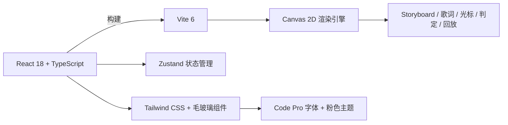

<div align="center">


<br/>

<p align="center">
  <sub><samp>纯前端 osu! 客户端 · Standard / Taiko / Catch / Mania · Storyboard / 歌词 / Auto / 回放</samp></sub>
</p>

<br/>

[](https://osu.yuiro.top)

<br/>

[](https://react.dev)
[](https://www.typescriptlang.org)
[](https://vitejs.dev)
[](https://tailwindcss.com)
[](https://github.com/pmndrs/zustand)

</div>

---

## 功能特性

| 模块 | 说明 |
| --- | --- |
| 多模式游玩 | osu!standard / taiko / catch / mania，含引导线、打击反馈、大音符、下落式按键 |
| 谱面获取 | 集成 osu.direct 与 Sayobot，支持关键词 / 歌曲名 / 歌手名筛选，可仅显示含 Storyboard 的谱面 |
| 本地下载管理 | IndexedDB 持久化，下载列表折叠展开，本地直接开玩 |
| Storyboard 支持 | 解析 `.osb` 与 `Events` 段落，支持 Sprite / Animation 及 F / M / S / R / C / P 等命令 |
| 歌词系统 | LRCLIB 开源歌词 API，游戏内底部显示当前歌词 |
| 回放系统 | 游戏结束当场查看输入回放，支持本地保存与管理 |
| Auto 演示 | 全模式 Auto，Standard 光标弹簧物理 + 拖尾反馈 |
| 全屏模式 | 浏览器全屏切换，桌面端与移动端均支持 |
| FPS 显示 | 游戏内右下角实时显示帧率 |

---

## 技术栈



| 类别 | 选型 |
| --- | --- |
| 框架 | React 18 + TypeScript + Vite 6 |
| 路由 | React Router DOM |
| 状态 | Zustand |
| 样式 | Tailwind CSS + 自定义毛玻璃组件 |
| 渲染 | 原生 Canvas 2D |
| 音频 | HTMLAudioElement |
| 解压 | JSZip |
| 存储 | IndexedDB |
| 图标 | Lucide React |
| 字体 | Code Pro |

---

## 快速开始

### 环境要求

- Node.js >= 18
- pnpm（推荐）或 npm

### 安装与运行

```bash
# 安装依赖
pnpm install

# 开发模式，默认 http://localhost:5173/
pnpm dev

# 构建生产版本
pnpm build

# 本地预览生产版本
pnpm preview
```

---

## 项目结构

```text
osu-web/
├── public/                 # 静态资源（Code Pro 字体、图标）
├── src/
│   ├── api/                # 搜索/下载 API 封装
│   ├── components/         # React 组件
│   │   ├── common/         # BeatmapCard、ModeBadge、StoryboardBadge
│   │   ├── glass/          # 毛玻璃风格按钮/卡片/开关
│   │   └── layout/         # 背景、顶部导航
│   ├── engine/             # 游戏核心引擎
│   │   ├── modes/          # Standard / Taiko / Catch / Mania
│   │   ├── renderer/       # Canvas 2D 绘制工具
│   │   ├── GameEngine.ts   # 引擎基类
│   │   └── Judger.ts       # 判定逻辑
│   ├── hooks/              # 自定义 Hooks
│   ├── pages/              # 页面组件
│   ├── store/              # Zustand 全局状态
│   ├── types/              # TypeScript 类型定义
│   ├── utils/              # .osu / .osb 解析、osz 解压、歌词等
│   ├── App.tsx
│   ├── main.tsx
│   └── index.css
├── package.json
├── tsconfig.json
├── vite.config.ts
└── README.md
```

---

## 支持的文件格式

| 格式 | 说明 |
| --- | --- |
| `.osz` | 谱面压缩包（自动解压） |
| `.osu` | 谱面文件 |
| `.osb` | Storyboard 脚本 |
| `.mp3` / `.ogg` | 音频 |
| `.png` / `.jpg` / `.jpeg` / `.webp` | 图片资源 |

---

## 设置项说明

| 设置项 | 说明 |
| --- | --- |
| 全局偏移 | 调整音频与谱面的时间差（毫秒） |
| 背景昏暗度 | 游戏内背景 / Storyboard 的变暗程度 |
| 显示 Storyboard | 是否渲染 Storyboard |
| 显示歌词 | 是否显示歌词（LRCLIB） |
| 搜索源 | osu.direct / Sayobot |
| 仅显示有 Storyboard | 搜索结果过滤（osu.direct 有效） |
| 下载类型 | 完整谱面包 / 精简谱面包 |
| 全屏模式 | 浏览器全屏切换 |

---

## 部署

纯静态前端，构建后部署 `dist/` 到任意静态托管服务：

[](https://pages.github.com)
[](https://vercel.com)
[](https://netlify.com)
[](https://pages.cloudflare.com)

---

## 致谢

- [osu!](https://osu.ppy.sh/) 社区与谱面作者
- [Sayobot](https://osu.sayobot.cn/) 搜索服务
- [osu.direct](https://osu.direct/) 搜索服务
- [LRCLIB](https://lrclib.net/) 开源歌词

<div align="center">
  
</div>
